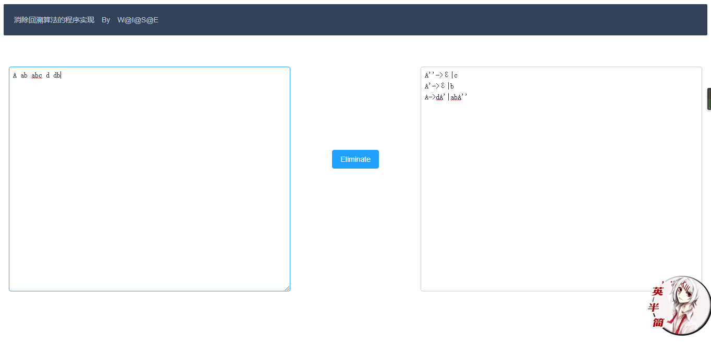

# Compile_Course_Project
消除回溯算法的程序实现

# Problem
消除回溯算法的程序实现

设计内容及要求：构造一程序，实现：消除文法每一条产生式候选式的公共左因子。
对于用户任意输入的文法G，输出一个无回溯的等价文法，可显示输出，或输出到指定文件中。

# Run

运行run.py文件，访问127.0.0.1：5000（需安装Flask）

# Format

文法输入：每个产生式一行，产生式中的各元素以空白字符隔开

# screenshot

